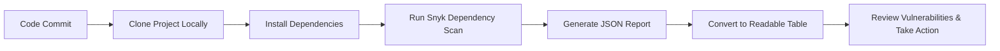

# Documentation on Generic CI Operation – License Scanning

## Author Information

| Last Updated On | Version | Author           | Level           | Reviewer               |
|-----------------|---------|------------------|-----------------|------------------------|
| 15-08-2025      | V1.0    | Kawalpreet Kour  | Internal Review | Pritam                 |
|                 |         | Kawalpreet Kour  | L0              | Shreya/Sharvari        |
|                 |         | Kawalpreet Kour  | L1              | Abhishek V             |
|                 |         | Kawalpreet Kour  | L2              | Abhishek Dubey/Rishabh sharma |

---

  
<h2><strong>Table of Contents</strong></h2>

- [Introduction](#introduction)
- [What is License Scanning?](#what-is-license-scanning)
- [Why License Scanning?](#why-license-scanning)
- [Workflow Diagram](#workflow-diagram)
- [Different Tools](#different-tools)
- [Comparison](#comparison)
- [Advantages](#advantages)
- [Best Practices](#best-practices)
- [Conclusion](#conclusion)
- [FAQs](#faqs)
- [References](#references)

---

## Introduction
This document provides a guide to license scanning in software build pipelines to track third-party dependencies and ensure legal compliance.

---

## What is License Scanning?
License scanning is the process of analyzing all third-party and open-source dependencies in a project to detect restricted or incompatible licenses and reduce legal risk.

---

## Why License Scanning?

| Reason              | Explanation |
|--------------------|-------------|
| Legal Compliance    | Avoid violations of open-source licenses. |
| Risk Management     | Identify risky dependencies before deployment. |
| Governance          | Maintain control over third-party libraries in projects. |

---

## Workflow Diagram

----
## Different Tools

| Tool        | Description                  | Pros                             | Cons                    |
|------------|-------------------------------|---------------------------------|------------------------|
| FOSSA      | Automated license compliance  | Detailed reports, enterprise support | Paid, setup complex    |
| WhiteSource| License & security scanning  | Good for large projects          | Complex setup          |
| Snyk       | License + security scanning  | Free tier, easy CI integration   | Limited free features  |
| Black Duck | Enterprise-level license scanning | Detailed reporting            | Paid, complex setup    |

---

## Comparison

| Feature/Tool           | FOSSA      | WhiteSource | Snyk        | Black Duck |
|------------------------|-----------|------------|------------|-----------|
| CI Integration          | Yes       | Yes        | Yes        | Yes       |
| Reporting               | Detailed  | Detailed   | Good       | Very Detailed |
| License Alerts          | Yes       | Yes        | Yes        | Yes       |
| Security Scanning       | No        | Optional   | Yes        | Optional  |
| Cost                    | Paid      | Paid       | Free/Paid  | Paid      |

---

## Advantages

| Advantage        | Explanation |
|-----------------|-------------|
| Compliance       | Identify and manage restricted licenses early. |
| Early Detection  | Detect risky dependencies before deployment. |
| CI Integration   | Automate scans in build pipelines. |
| Reporting        | Provides audit-ready reports for stakeholders. |

---
## Best Practices

| Practice                          | Explanation                                      |
|----------------------------------|-------------------------------------------------|
| Run license scans on every build  | Ensure every build checks for license issues.  |
| Maintain an allowlist of licenses | Keep a list of approved licenses for compliance.|
| Configure alerts for restricted licenses | Notify teams when restricted licenses are detected. |
| Keep scanning tools and dependencies updated | Ensure tools and dependencies are up-to-date to catch latest issues. |

---
## Conclusion

Based on ease of use, CI integration, and free tier availability, we recommend Snyk for license scanning in software build pipelines. Implementing Snyk will help teams continuously monitor third-party dependencies, detect license issues early, and maintain compliance with minimal manual effort.

---

## FAQs

1. **How do I run license and dependency scanning manually?**  
   Clone the project, install dependencies, and run Snyk CLI.

2. **What if a restricted license or vulnerability is found?**  
   Check the report and fix issues manually before deployment.

3. **Can I detect security vulnerabilities too?**  
   Yes, Snyk CLI scans both licenses and known vulnerabilities manually.

---
## Contact Information

| Name             | Email                          |
|------------------|--------------------------------|
| Kawalpreet Kour  | kawalpreet.kour.snaatak@mygurukulam.co |

---
## References

| Description                   | Link                                        |
|-------------------------------|---------------------------------------------|
| Snyk Official Website          | https://snyk.io                            |
| FOSSA Official Website         | https://fossa.com                          |
