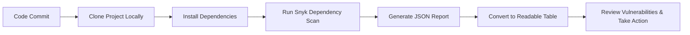

# POC on GoLang CI Checks – Dependency Scanning

---
## Author Information

| Last Updated On | Version | Author           | Level           | Reviewer               |
|-----------------|---------|------------------|-----------------|------------------------|
| 16-08-2025      | V1.0    | Kawalpreet Kour  | Internal Review | Pritam                 |
|                 |         | Kawalpreet Kour  | L0              | Shreya/Sharvari        |
|                 |         | Kawalpreet Kour  | L1              | Abhishek V             |
|                 |         | Kawalpreet Kour  | L2              | Abhishek Dubey/Rishabh sharma |

---
# Documentation: Dependency Scanning in Go Projects

---

  
<h2><strong>Table of Contents</strong></h2>

- [Introduction](#introduction)  
- [What is Dependency Scanning?](#what-is-dependency-scanning)  
- [Why Dependency Scanning?](#why-dependency-scanning)  
- [Workflow Diagram](#workflow-diagram)  
- [Different Tools](#different-tools)  
- [Comparison](#comparison)  
- [Advantages](#advantages)  
- [Best Practices](#best-practices)  
- [Conclusion](#conclusion)  
- [FAQs](#faqs)  
- [References](#references)  

---

## Introduction

This document provides a guide to dependency scanning in Go projects to track third-party packages and identify known security vulnerabilities.

---

## What is Dependency Scanning?

Dependency scanning involves checking all project dependencies against a database of known security vulnerabilities. The scanner identifies outdated, vulnerable, or risky packages that could compromise the application.

---

## Why Dependency Scanning?

| Benefit            | Description                                               |
|-------------------|-----------------------------------------------------------|
| Early detection    | Identifies vulnerabilities before production deployment. |
| Compliance         | Ensures the project meets security and organizational standards. |
| Risk reduction     | Prevents attacks exploiting vulnerable dependencies.    |
| Maintainability    | Keeps dependencies up-to-date and safe.                 |

---

## Workflow Diagram

---

## Different Tools

| Tool                     | Supported Languages                       | Notes                                    |
|---------------------------|------------------------------------------|------------------------------------------|
| Snyk                     | Go, Node.js, Java, Python, Ruby, PHP    | Popular tool with detailed reports       |
| Dependabot               | Multiple (GitHub projects)              | Automated updates and vulnerability alerts |
| OWASP Dependency-Check    | Java, .NET, Node.js                     | Open-source scanner for security testing |

---

## Comparison

| Feature                     | Snyk             | Dependabot        | OWASP Dependency-Check |
|------------------------------|-----------------|-----------------|-----------------------|
| Manual Scan                  | Yes             | No              | Yes                   |
| Report Output                | JSON/HTML       | Limited         | JSON                  |
| Multiple Language Support    | Yes             | Limited         | Limited               |
| Integration with CI/CD       | Yes             | Yes             | Yes                   |

---

## Advantages

| Advantage                        | Description                                              |
|---------------------------------|----------------------------------------------------------|
| Secure code                       | Helps maintain secure code by detecting vulnerable dependencies. |
| Multi-language support            | Supports multiple programming languages including Go.  |
| Detailed reports                  | Provides detailed reports for developers.              |
| CI/CD integration                 | Can be integrated into CI/CD pipelines or run manually. |

---

## Best Practices

| Practice                           | Description                                               |
|-----------------------------------|-----------------------------------------------------------|
| Update dependencies                | Regularly update dependencies to the latest safe versions. |
| Monitor vulnerabilities            | Monitor new vulnerabilities for existing packages.       |
| Use automated tools                 | Use automated tools for continuous scanning.            |
| Review reports                     | Format and review reports to prioritize critical vulnerabilities. |

---

## Conclusion

Dependency scanning is essential for modern software security. Tools like Snyk, Dependabot, and OWASP Dependency-Check provide ways to identify and remediate vulnerable dependencies. For Go projects, **Go modules (gomod)** combined with Snyk offers a simple and effective manual scanning solution. Regular scanning ensures secure, compliant, and maintainable codebases.

---

## FAQs

1. **What is dependency scanning?**  
   - Checking project libraries for known vulnerabilities.  

2. **Why is it important?**  
   - Detects security risks early and ensures compliance.  

3. **Which tools are commonly used?**  
   - Snyk, Dependabot, OWASP Dependency-Check.  

---

## Contact Information

| Name             | Email                          |
|------------------|--------------------------------|
| Kawalpreet Kour  | kawalpreet.kour.snaatak@mygurukulam.co |

---
## References

| Description                               | Link                                                                 |
|-------------------------------------------|----------------------------------------------------------------------|
| Go Programming Language Official Website  | [https://go.dev/](https://go.dev/)                                   |
| Snyk CLI Documentation                     | https://docs.snyk.io/developer-tools/snyk-cli                       |
| Getting Started with Snyk CLI             | https://docs.snyk.io/developer-tools/snyk-cli/getting-started-with-the-snyk-cli |
