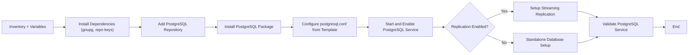

# PostgreSQL Ansible Role – Documentation


---
## Author Information

| Last Updated On | Version | Author           | Level            | Reviewer                      |
|-----------------|---------|------------------|------------------|-------------------------------|
| 01-09-2025      | V1.1    | Kawalpreet Kour  | Internal Review  | Pritam                        |
|                 |         | Kawalpreet Kour  | L0               | Shreya / Sharvari             |
|                 |         | Kawalpreet Kour  | L1               | Abhishek V                    |
|                 |         | Kawalpreet Kour  | L2               | Abhishek Dubey                |

---

<details>
  <summary><h2><strong>Table of Contents</strong></h2></summary>

- [Introduction](#introduction)  
- [Pre-requisites](#pre-requisites) 
- [Workflow Diagram](#workflow-diagram)  
- [Ansible Role Directory Structure](#ansible-role-directory-structure)  
- [Role Components](#role-components)  
- [Variables and Templates](#variables-and-templates)  
- [Advantages](#advantages)  
- [Best Practices](#best-practices)  
- [FAQs](#faqs)  
- [Contact Information](#contact-information)  
- [References](#references)

</details>

---

## Introduction

This documentation defines the Ansible Role that automates the installation and configuration of PostgreSQL on target Ubuntu servers, enabling you to deploy and manage PostgreSQL easily and consistently.


---

## Pre-requisites


| Item                  | Description                                                                 |
|-----------------------|-----------------------------------------------------------------------------|
| **OS Compatibility**  | CentOS 7/8, RHEL 7/8, Ubuntu 22.04+                                        |
| **Python**            | Python 3.x (required by Ansible)                                           |
| **Ansible Version**   | >= 2.9                                                                     |
| **Inventory File**    | Must define all target nodes with correct IPs or hostnames                 |
| **Private Key**       | Required for SSH authentication (password-less login recommended)          |
| **Ports**             | Required service ports must be open as per environment needs               |

---

> **Reference**: [PostgreSQL Documentation](https://github.com/Snaatak-Apt-Get-Swag/documentation/tree/main/OT-Microservices/Softwares/Postgresql/Introduction)

---

> **Reference**: [Ansible Role Documentation](https://github.com/Snaatak-Apt-Get-Swag/documentation/tree/main/Ansible/Role/Directory-Structure)

---

## Workflow Diagram


---
## Ansible Role Directory Structure
```bash
Postgresql_role/
├── defaults/
│   └── main.yml                # Default variables like version, URLs
├── tasks/
│   ├── main.yml                # Main task file for installing and configuring PostgreSQL
│   └── install.yml             # Installation and configuration tasks for Ubuntu
├── templates/
│   └── postgresql.conf.j2     # PostgreSQL configuration template
├── handlers/
│   └── main.yml                # Handlers to restart PostgreSQL
├── vars/
│   └── main.yml                # Environment-specific variables
└── meta/
    └── main.yml                # Metadata about the role
```
