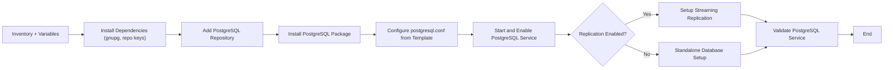

# PostgreSQL Ansible Role – Documentation


---
## Author Information

| Last Updated On | Version | Author           | Level            | Reviewer                      |
|-----------------|---------|------------------|------------------|-------------------------------|
| 08-09-2025      | V1.0    | Kawalpreet Kour  | Internal Review  | Pritam                        |
|                 |         | Kawalpreet Kour  | L0               | Shreya / Sharvari             |
|                 |         | Kawalpreet Kour  | L1               | Abhishek V                    |
|                 |         | Kawalpreet Kour  | L2               | Abhishek Dubey                |

---

<details>
  <summary><h2><strong>Table of Contents</strong></h2></summary>

- [Introduction](#introduction)  
- [Pre-requisites](#pre-requisites) 
- [Workflow Diagram](#workflow-diagram)  
- [Ansible Role Directory Structure](#ansible-role-directory-structure)  
- [Role Components](#role-components)  
- [Variables and Templates](#variables-and-templates)  
- [Advantages](#advantages)  
- [Best Practices](#best-practices)  
- [FAQs](#faqs)  
- [Contact Information](#contact-information)  
- [References](#references)

</details>

---

## Introduction

This documentation defines the Ansible Role that automates the installation and configuration of PostgreSQL on target Ubuntu servers, enabling you to deploy and manage PostgreSQL easily and consistently.


---

## Pre-requisites


| Item                  | Description                                                                 |
|-----------------------|-----------------------------------------------------------------------------|
| **OS Compatibility**  | CentOS 7/8, RHEL 7/8, Ubuntu 22.04+                                        |
| **Python**            | Python 3.x (required by Ansible)                                           |
| **Ansible Version**   | >= 2.9                                                                     |
| **Inventory File**    | Must define all target nodes with correct IPs or hostnames                 |
| **Private Key**       | Required for SSH authentication (password-less login recommended)          |
| **Ports**             | Required service ports must be open as per environment needs               |

---

> **Reference**: [PostgreSQL Documentation](https://github.com/Snaatak-Apt-Get-Swag/documentation/tree/main/OT-Microservices/Softwares/Postgresql/Introduction)

---

> **Reference**: [Ansible Role Documentation](https://github.com/Snaatak-Apt-Get-Swag/documentation/tree/main/Ansible/Role/Directory-Structure)

---

## Workflow Diagram


---
## Ansible Role Directory Structure
```bash
Postgresql_role/
├── defaults/
│   └── main.yml                # Default variables like version, URLs
├── tasks/
│   ├── main.yml                # Main task file for installing and configuring PostgreSQL
│   └── install.yml             # Installation and configuration tasks for Ubuntu
├── templates/
│   └── postgresql.conf.j2     # PostgreSQL configuration template
├── handlers/
│   └── main.yml                # Handlers to restart PostgreSQL
├── vars/
│   └── main.yml                # Environment-specific variables
└── meta/
    └── main.yml                # Metadata about the role
```

---
## Role Components

| Component   | Purpose |
|-------------|---------|
| **defaults/** | Provides default settings such as PostgreSQL version and directories |
| **tasks/**    | Contains modular tasks like installation, configuration, initialization, and replication setup |
| **templates/** | Uses Jinja2 templates to dynamically configure `postgresql.conf` and `pg_hba.conf` |
| **handlers/**  | Ensures service reload or restart after configuration changes |
| **vars/**      | Overrides specific to environments like replication, authentication, or logging |
| **meta/**      | Contains metadata and supported OS platforms |

---

## Variables and Templates

| Variable Name            | Description                       | Default Value      |
|--------------------------|-----------------------------------|-------------------|
| `postgresql_version`      | PostgreSQL version to install     | `14`              |
| `postgresql_data_dir`     | Data directory path               | `/var/lib/pgsql/data` |
| `postgresql_listen_address` | Address PostgreSQL listens on   | `{{ ansible_host }}` |
| `postgresql_port`         | Port used for PostgreSQL          | `5432`            |
| `postgresql_replication`  | Enable replication (true/false)   | `false`           |
| `replication_user`        | User for replication              | `replicator`      |
| `replication_password`    | Password for replication user    | `changeme`        |

---
#### Templates:`postgresql.conf.j2`

| Parameter           | Description                          |
|-------------------|-------------------------------------|
| `listen_addresses`  | Defines the network interfaces PostgreSQL listens on |
| `port`              | The port PostgreSQL accepts connections on |
| `max_connections`   | Maximum number of concurrent connections |
| `logging_collector` | Enables logging of PostgreSQL activities |
| `wal_level`         | Determines the level of Write-Ahead Logging |
| `archive_mode`      | Enables or disables WAL archiving |

---

#### `pg_hba.conf.j2`

| Authentication Type | Description |
|--------------------|-------------|
| Local connections  | Allow users to connect from the local machine |
| Password-based authentication | Secure access using passwords |
| Replication access from specific hosts | Allows replication users from specified IP addresses or networks |

---
## Advantages

| Benefit                 | Description |
|------------------------|-------------|
| **Automated setup**      | Quickly deploy PostgreSQL servers across environments |
| **Configuration consistency** | Templates ensure uniform settings |
| **Supports replication** | Easily scale database with primary-replica setups |
| **Security-first approach** | Configurable authentication and access control |
| **Integrates with CI/CD** | Suitable for pipeline-based deployments |

---

## Best Practices

| Practice            | Description |
|-------------------|-------------|
| **Use Ansible Vault** | Protect replication credentials and sensitive data |
| **Tagging**           | Use tags like install, configure, replication for task control |
| **Validate in dry-run** | Use `--check` to preview changes before applying |
| **Test on non-production first** | Avoid impacting live data |
| **Enable detailed logging** | Helps diagnose connection and replication issues |

---

## FAQs

**Q1: Can this role setup PostgreSQL replication?**  
A: Yes, by setting `postgresql_replication` to true and providing appropriate user credentials and host settings.

**Q2: How do I change configuration parameters like `max_connections`?**  
A: Override the variables in `group_vars` or `host_vars` as per environment requirements.

**Q3: Can I use this role for multiple PostgreSQL versions?**  
A: Yes, by specifying `postgresql_version`, the role will install the desired version from the correct repository.

---

## Contact Information

| Name              | Email |
|-----------------|------------------------------|
| **Kawalpreet Kour** | kawalpreet.kour.snaatak@mygurukulam.co |

---

## References

| Description | Link |
|-------------|------|
| **PostgreSQL Documentation** | [GitHub – Introduction](https://github.com/Snaatak-Apt-Get-Swag/documentation/tree/main/OT-Microservices/Softwares/Postgresql/Introduction) |
| **POC on PostgreSQL** | [GitHub – POC](https://github.com/Snaatak-Apt-Get-Swag/documentation/tree/main/OT-Microservies/Softwares/Postgresql/POC) |
| **Ansible Role Directory Structure** | [GitHub – Role Structure](https://github.com/Snaatak-Apt-Get-Swag/documentation/tree/main/Ansible/Role/Directory-Structure) |
| **Ansible Static Inventory** | [GitHub – Static Inventory](https://github.com/Snaatak-Apt-Get-Swag/documentation/tree/main/Ansible/Inventory/Static-Inventory) |
| **Ansible Dynamic Inventory** | [GitHub – Dynamic Inventory](https://github.com/Snaatak-Apt-Get-Swag/documentation/tree/main/Ansible/Inventory/Dynamic-Inventory) |
