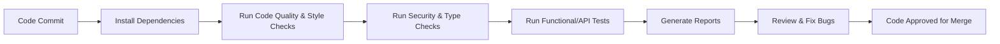

# Documentation on Python CI Checks - Bug Analysis

---
## Author Information

| Last Updated On | Version | Author           | Level           | Reviewer               |
|-----------------|---------|------------------|-----------------|------------------------|
| 19-08-2025      | V1.0    | Kawalpreet Kour  | Internal Review | Pritam                 |
|                 |         | Kawalpreet Kour  | L0              | Shreya/Sharvari        |
|                 |         | Kawalpreet Kour  | L1              | Abhishek V             |
|                 |         | Kawalpreet Kour  | L2              | Abhishek Dubey/Rishabh sharma |

---

  
<h2><strong>Table of Contents</strong></h2>

- [Introduction](#introduction)  
- [What is Bug Analysis?](#what-is-bug-analysis)  
- [Why Bug Analysis in CI?](#why-bug-analysis-in-ci)  
- [Workflow Diagram](#workflow-diagram)  
- [Different Tools](#different-tools)  
- [Comparison](#comparison)  
- [Advantages](#advantages)  
- [Best Practices](#best-practices)  
- [Conclusion](#conclusion)  
- [Contact Information](#contact-information)  
- [References](#references)  

---
## Introduction

This document provides a guide to Python CI Bug Analysis, focusing on detecting code errors, bugs, security vulnerabilities, and ensuring reliable and maintainable functionality.

---

## What is Bug Analysis?
Bug Analysis is the process of finding and categorizing software defects during CI.It helps detect coding errors, vulnerabilities, and test failures early for quick fixes.  
---

## Why Bug Analysis in CI?
| Reason              | Explanation |
|---------------------|-------------|
| **Early Detection** | Bugs are identified before deployment, reducing costly fixes later. |
| **Improved Quality**| Ensures cleaner and more maintainable Python code. |
| **Security**        | Identifies vulnerabilities and prevents exploitation. |
| **Automation**      | Eliminates manual bug checks by integrating into CI/CD. |
| **Continuous Feedback** | Developers get instant alerts on introduced bugs. |

---
## Workflow Diagram

---
## Different Tools
| Tool       | Notes |
|------------|-------|
| **SonarQube** | Comprehensive bug analysis and quality gates for Python and other languages. |
| **Pytest**    | Used for automated testing and catching runtime bugs. |
| **Bandit**    | Focused on Python security vulnerabilities. |
| **Pylint**    | Detects coding errors and enforces code style. |

---

## Comparison
| Feature                | SonarQube | Pytest       | Bandit       | Pylint        |
|-------------------------|-----------|--------------|--------------|---------------|
| **Bug Detection**       | Comprehensive (bugs, smells, vulnerabilities) | Runtime only | Security only | Code logic/style |
| **Report Output**       | Dashboard, JSON, HTML | Console/HTML | JSON/Console | Text/JSON |
| **CI/CD Integration**   | Strong    | Strong       | Moderate     | Moderate      |
| **Multi-Language Support** | Yes   | Python only | Python only | Python only |
| **Ease of Use**         | Medium setup | Easy       | Easy         | Easy          |

---
## Advantages

| Advantage             | Description                              |
|------------------------|------------------------------------------|
| **Higher Code Quality**    | Reduces defects before release.          |
| **Security Compliance**    | Detects vulnerabilities early.           |
| **Automation Friendly**    | Works seamlessly in pipelines.           |
| **Continuous Monitoring**  | Dashboards show live metrics.            |
| **Time Saving**           | Less debugging post-deployment.          |

---

## Best Practices
| Practice              | Description |
|-----------------------|-------------|
| **Shift-Left Testing** | Run bug analysis early in development. |
| **Automate Checks**   | Add analysis into every CI build. |
| **Define Quality Gates** | Example: allow zero critical bugs before merge. |
| **Review Reports Regularly** | Prioritize high severity issues. |
| **Use Dashboards**    | Track trends for long-term improvements. |

---
## Conclusion  

SonarQube is the best choice for Python CI Bug Analysis as it provides bug detection, security checks, and detailed dashboards in one platform.  
Its seamless CI/CD integration and multi-language support make it scalable and reliable for teams.  

---
## Contact Information

| Name             | Email                          |
|------------------|--------------------------------|
| **Kawalpreet Kour**  | kawalpreet.kour.snaatak@mygurukulam.co |

---
## References

