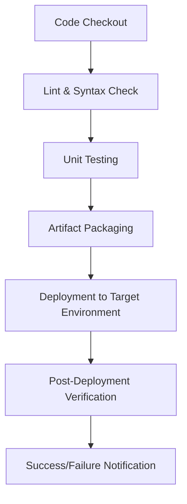

# Ansible Role & Playbook CI/CD Documentation


---

## Author Information

| Last Updated On | Version | Author           | Level            | Reviewer                      |
|-----------------|---------|-----------------|-----------------|-------------------------------|
| 21-09-2025      | V1.0    | Kawalpreet Kour | Internal Review | Sharvari                      |
|                 |         | Kawalpreet Kour | L0              | Shreya                        |
|                 |         | Kawalpreet Kour | L1              | Abhishek V                    |
|                 |         | Kawalpreet Kour | L2              | Abhishek Dubey                |

---

<details>
  <summary><h2><strong>Table of Contents</strong></h2></summary>

- [Introduction](#introduction)
- [Setup Instructions](#setup-instructions)
- [CI/CD Process Workflow](#cicd-process-workflow)
- [Configuration](#configuration)
- [Limitations / Known Issues](#limitations--known-issues)
- [Best Practices](#best-practices)
- [FAQs](#faqs)
- [Contact Information](#contact-information)
- [References](#references)

</details>

---

## Introduction

This documentation provides a comprehensive guide for automating and standardizing deployment pipelines using Ansible roles and playbooks, including setup instructions, CI/CD process overview, configurations, and best practices.

---


### Pr-erequisites

| Tool / Requirement     | Minimum Version / Notes                     | Purpose / Description                              |
|------------------------|--------------------------------------------|---------------------------------------------------|
| Git                    | Latest stable                               | Version control and repository management        |
| Ansible                | ≥ 2.13                                     | Automation of playbooks and roles                |
| CI/CD Tool             | Jenkins, GitLab CI/CD, or similar          | Pipeline automation                               |
| Python                 | 3.x                                        | Required for Ansible and supporting scripts      |
| SSH Access             | N/A                                        | Secure access to target servers for deployment   |


---

> **Reference**: [Ansible Role Documentation](https://github.com/Snaatak-Apt-Get-Swag/documentation/tree/main/Ansible/Role/Directory-Structure)

> **Reference**: [Ansible Playbook Documentation](https://github.com/Snaatak-Apt-Get-Swag/documentation/tree/main/Ansible/Playbook/CD)
--

### Setup Steps

| Step                         | Command / Action                                                                                     | Description                                               |
|-------------------------------|----------------------------------------------------------------------------------------------------|-----------------------------------------------------------|
| **Clone the Repository**          | ```bash git clone <repository_url> ansible-cicd-library cd ansible-cicd-library ```                | **Downloads the shared library and navigates into it**       |
| **Install Dependencies**          | ```bash ansible-galaxy install -r requirements.yml ```                                             | **Installs required Ansible roles and dependencies**         |
| **Configure Environment Variables** | Update `.env` or CI/CD secret variables: <br>- `TARGET_ENV` (dev/test/prod) <br>- `SSH_KEY_PATH` (path to private key) <br>- `ANSIBLE_CONFIG` (optional) <br>- Any project-specific variables | Sets environment-specific configuration for deployment  |
| **Verify Setup**                  | ```bash ansible-playbook tests/test.yml --check ```                                                | **Runs a dry-run to ensure the setup is functional**        |

---
### CI/CD Process Workflow

| Stage                        | Description                                                                                   |
|-------------------------------|-----------------------------------------------------------------------------------------------|
| **Code Checkout**                 | Pull latest roles and playbooks from the repository                                           |
| **Linting & Syntax Check**        | Validate YAML and playbook syntax using `ansible-lint` and `ansible-playbook --syntax-check` |
| **Unit Testing**                  | Run Molecule or custom test playbooks to verify roles                                         |
| **Artifact Packaging**            | Bundle roles, playbooks, and templates for deployment                                         |
| **Deployment**                    | Apply playbooks to the target environment (Dev/QA/Prod)                                       |
| **Post-Deployment Verification**  | Perform smoke tests, service checks, or log validation                                        |
| **Notifications**                | Send success/failure status to CI/CD tool or Slack/email                                      |


---

## Flow Diagram


---
## Configuration

### Key Files & Folders

| File/Folder                 | Purpose                                    |
|------------------------------|-------------------------------------------|
| **`roles/`**                    | Reusable Ansible roles                     |
| **`playbooks/`**                | Main deployment playbooks                  |
| **`inventory/`**                | Environment-specific host files            |
| **`vars/`**                     | Shared variables                           |
| **`tests/`**                    | Test playbooks for validation              |
| **`requirements.yml`**          | Dependencies for `ansible-galaxy`         |
| **`Jenkinsfile` / `.gitlab-ci.yml`** | CI/CD pipeline definitions             |

### Environment Variables

| Variable Name      | Description                                  |
|-------------------|----------------------------------------------|
| **`TARGET_ENV`**       | Deployment environment (dev/test/prod)      |
| **`SSH_KEY_PATH`**     | Path to SSH private key                      |
| **`ANSIBLE_CONFIG`**   | Path to custom `ansible.cfg`                |
| **`CI_CREDENTIALS`**   | Encrypted credentials for deployment        |

---

## Limitations / Known Issues

| Limitation / Issue                                                      | Description |
|-------------------------------------------------------------------------|-------------|
| **SSH-based access required**                                                | Password-based deployments are not fully supported |
| **OS-specific role dependencies**                                            | Some roles require specific OS versions or packages |
| **Windows server deployment**                                                | Adjustments may be needed; framework optimized for Linux |
| **Variable conflicts**                                                       | Custom playbooks may override shared variables |
| **Large playbooks**                                                          | May cause CI/CD runner timeouts; modularization recommended |

---

## Best Practices

| Best Practice                                                             | Description |
|---------------------------------------------------------------------------|-------------|
| **Use feature branches**                                                      | Test changes locally before merging |
| **Version-control roles and playbooks**                                       | Avoid breaking dependent pipelines |
| **Store credentials securely**                                                | Keep sensitive credentials in CI/CD secret stores, not repository |
| **Run linters and tests**                                                     | Use `ansible-lint` and Molecule on each commit |
| **Modularize playbooks**                                                      | Break large playbooks into smaller roles for maintainability |

---

## FAQs

**Q: Can this framework deploy to Windows servers?**  
A: It is optimized for Linux; Windows may require role adjustments.  

**Q: Can I use password-based SSH access?**  
A: SSH key-based authentication is recommended; password-based deployments are not fully supported.  

**Q: How can I test roles locally?**  
A: Use Molecule or the `tests/test.yml` playbook in dry-run mode.  

**Q: Can Terraform drift be fully prevented?**  
A: No, but limiting direct access and automating detection minimizes risks.  

---

## Contact Information

| Name | Email |
|------|------|
| **Kawalpreet Kour** | kawalpreet.kour.snaatak@mygurukulam.co |

---

## References

| Description                     | Link                                                                 |
|---------------------------------|----------------------------------------------------------------------|
| **Ansible Role Documentation**  | [Directory Structure](https://github.com/Snaatak-Apt-Get-Swag/documentation/tree/main/Ansible/Role/Directory-Structure) |
| **Ansible Playbook Documentation** | [CI/CD Setup](https://github.com/Snaatak-Apt-Get-Swag/documentation/tree/main/Ansible/Playbook/CD) |

 
