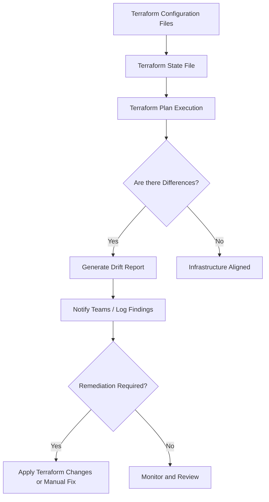

# Documentation On Terraform Drift

 

---

## Author Information

| Last Updated On | Version | Author           | Level            | Reviewer                      |
|-----------------|---------|------------------|------------------|-------------------------------|
| 16-09-2025      | V1.0    | Kawalpreet Kour  | Internal Review  | Pritam                        |
|                 |         | Kawalpreet Kour  | L0               | Shreya / Sharvari             |
|                 |         | Kawalpreet Kour  | L1               | Abhishek V                    |
|                 |         | Kawalpreet Kour  | L2               | Abhishek Dubey / Rishabh Sharma |

---

  
<h2><strong>Table of Contents</strong></h2>

1. [Introduction](#introduction)
2. [What is Terraform Drift?](#what-is-terraform-drift)
3. [Why is Drift Detection Necessary?](#why-is-drift-detection-necessary)
4. [Advantages](#advantages)
5. [Workflow for Drift Detection](#workflow-for-drift-detection)
6. [Workflow Steps](#workflow-steps)
7. [Design Strategy](#design-strategy)
   - [Core Components](#core-components)
8. [Tools Used](#tools-used)
9. [Automation Approach](#automation-approach)
10. [Best Practices](#best-practices)
11. [FAQs](#faqs)
12. [Contact Information](#contact-information)
13. [References](#references)

---

## Introduction
The document provides an overview of why drift detection is necessary, how it works, the tools involved, and the steps to automate drift monitoring and remediation.

---

## What is Terraform Drift?

Terraform Drift refers to the situation where changes are made to the infrastructure outside of Terraform’s management, resulting in a mismatch between the desired state defined in Terraform configuration files and the actual state of resources in the cloud environment. Such drift can occur when modifications are performed manually through cloud provider consoles, external scripts, or automated processes that do not update the Terraform state. If left undetected, drift can lead to security vulnerabilities, operational inconsistencies, compliance issues, and unexpected costs.

---
## Why is Drift Detection Necessary?

| Why Drift Detection Matters | Description |
|----------------------------|-------------|
| **Security Risks**          | Unauthorized changes can expose data and resources. |
| **Compliance Failures**    | Infrastructure might not meet audit requirements. |
| **Operational Instability** | Misconfigured resources lead to downtime or degraded performance. |
| **Unexpected Costs**       | Resources changed or added outside Terraform may increase expenses. |
| **Configuration Consistency** | Ensures that infrastructure matches code for easier maintenance and scaling. |

---

## Advantages 

| Advantage                 | Description |
|---------------------------|-------------|
| **Early Detection**        | Spot configuration changes before they cause failures. |
| **Improved Governance**   | Maintains alignment with organizational standards and compliance. |
| **Automation Friendly**   | Enables automated monitoring, reducing manual oversight. |
| **Enhanced Security**     | Prevents unauthorized or accidental changes from exposing vulnerabilities. |
| **Cost Management**       | Helps identify unnecessary or orphaned resources consuming budgets. |
| **Scalable Infrastructure** | Supports consistent deployment across multiple environments. |

---

## Workflow for Drift Detection

---
## Workflow Steps

| Step                | Description |
|--------------------|-------------|
| **Fetch Latest State** | Retrieve the current state from the remote backend or local file. |
| **Compare with Real Infrastructure** | Run `terraform plan` to compare the desired state and actual state. |
| **Detect Differences** | Identify changes in resource configuration, tags, sizes, or missing resources. |
| **Generate Report** | Log the drift in structured formats (JSON, text, or dashboards). |
| **Notify Teams** | Send alerts via email, Slack, or monitoring systems. |
| **Remediation** | Review and decide whether to apply fixes via `terraform apply` or manually adjust resources. |

---

## Design Strategy

The design focuses on ensuring automated, repeatable, and secure drift detection by combining Terraform’s capabilities with cloud provider APIs and monitoring tools.

### Core Components

| Component         | Purpose |
|-----------------|---------|
| **Terraform State** | Acts as the source of truth for infrastructure definitions. |
| **Provider APIs** | Fetch real-time data to compare with Terraform’s state. |
| **Plan Execution** | Compares desired vs actual infrastructure. |
| **Monitoring System** | Tracks changes and notifies stakeholders. |
| **Automation Pipeline** | Runs drift checks on schedule or upon events. |
| **Access Controls** | Restrict direct changes to infrastructure to avoid unauthorized drift. |

---

## Tools Used

| Tool / Service                  | Role |
|---------------------------------|------|
| **`terraform plan`**              | Core drift detection engine comparing states. |
| **Terraform Cloud / Enterprise** | Provides dashboards and governance tools. |
| **AWS Config / Azure Policy / GCP Asset Inventory** | Tracks changes at cloud level and feeds into reports. |
| **S3, GCS, etc.**                | Remote state storage ensures shared, versioned state files. |
| **Monitoring Systems (Slack, Email)** | Alerts for detected drift. |
| **CI/CD (Jenkins, GitHub Actions)** | Automate drift detection and remediation. |

---

## Automation Approach

| Area                  | Practice                | Description |
|-----------------------|------------------------|-------------|
| **Scheduled Checks**   | Scheduled Checks       | Configure cron jobs or pipeline triggers to run `terraform plan` periodically. |
| **State Management**   | State Management       | Use remote state storage with versioning to ensure consistency and rollback capabilities. |
| **Reporting**          | Reporting              | Output structured drift reports (e.g., JSON files) for audit trails. |
| **Notification**       | Notification           | Integrate with Slack, email, or dashboards for real-time alerts. |
| **Remediation Workflow** | Remediation Workflow | Approve changes via manual review or automatically apply fixes based on predefined policies. |

---

## Best Practices

| Practice                | Description |
|------------------------|-------------|
| **Use Remote State Storage** | Keep the Terraform state secure and version-controlled. |
| **Limit Infrastructure Access** | Avoid making changes outside Terraform’s scope. |
| **Schedule Drift Detection** | Run drift checks regularly to catch changes early. |
| **Review Reports Thoroughly** | Analyze detected drift before applying any fix. |
| **Use Policy as Code** | Implement guardrails with tools like Sentinel or OPA. |
| **Test Changes in Development** | Avoid direct production modifications by testing first in a sandbox environment. |
| **Enable Audit Logging** | Keep logs for troubleshooting and compliance verification. |

---

## FAQs

**Q: Can Terraform drift be fully prevented?**  
**A:** No, but limiting direct access and automating detection minimizes risks.

**Q: How often should drift checks run?**  
**A:** Nightly is recommended for most environments; highly regulated environments may require hourly scans.

**Q: Can drift detection scale across multiple clouds?**  
**A:** Yes. Terraform providers and remote state allow multi-cloud management.

**Q: Is automated remediation recommended?**  
**A:** It depends on your governance structure; manual approval workflows are safer for production environments.

---

## Contact Information

| Name | Email |
|------|------|
| **Kawalpreet Kour** | kawalpreet.kour.snaatak@mygurukulam.co |

---

##References

| Description | Link |
|------------|------|
| **Terraform Drift Documentation** | [https://www.terraform.io/docs](https://medium.com/@mike_tyson_cloud/terraform-drift-detection-how-to-monitor-and-remediate-cloud-infrastructure-drift-3e365921420) |
| **Manage Resource Drift** | [https://www.terraform.io/cloud](https://developer.hashicorp.com/terraform/tutorials/state/resource-drift) |
| **Detecting and Managing Drift with Terraform** | [https://aws.amazon.com/config/](https://www.hashicorp.com/en/blog/detecting-and-managing-drift-with-terraform) |
