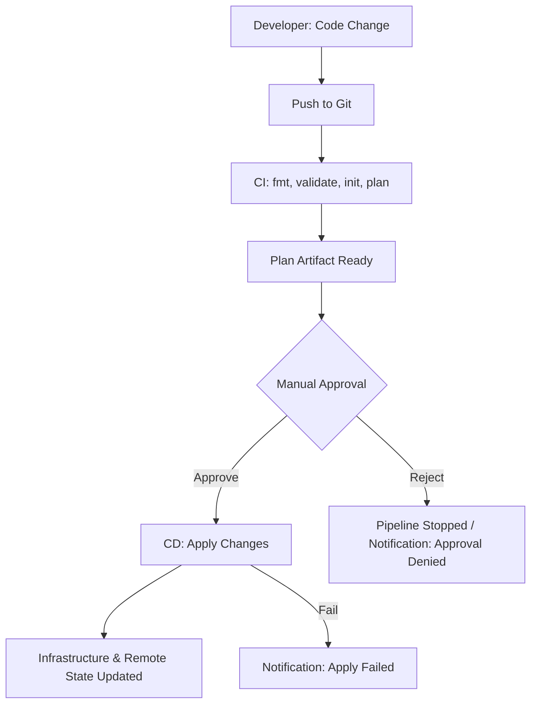

# Documentation On Terraform Wrapper Code CI/CD  

 

---

## Author Information

| Last Updated On | Version | Author           | Level            | Reviewer                      |
|-----------------|---------|------------------|------------------|-------------------------------|
| 30-09-2025      | V1.0    | Kawalpreet Kour  | Internal Review  | Sharvari                      |
|                 |         | Kawalpreet Kour  | L0               | Shreya                        |
|                 |         | Kawalpreet Kour  | L1               | Abhishek V                    |
|                 |         | Kawalpreet Kour  | L2               | Abhishek Dubey |

 

---
<details>
  <summary><h2><strong>Table of Contents</strong></h2></summary>

1. [Introduction](#introduction)  
2. [What is Terraform Wrapper Code?](#what-is-terraform-wrapper-code)  
3. [Why Use Terraform Wrapper Code?](#why-use-terraform-wrapper-code)  
4. [Structure of Environment-Specific Deployments](#structure-of-environment-specific-deployments)  
   - [Directory Structure](#directory-structure)  
   - [Description of Key Components](#description-of-key-components)  
5. [Variables and Secrets Handling](#variables-and-secrets-handling)  
6. [CI/CD Pipeline Stages](#cicd-pipeline-stages)  
   - [Continuous Integration (CI)](#continuous-integration-ci)  
   - [Continuous Deployment (CD)](#continuous-deployment-cd)  
7. [Workflow Diagram](#workflow-diagram)  
8. [Best Practices](#best-practices)  
9. [FAQs](#faqs)  
10. [Contact Information](#contact-information)  
11. [References](#references)  

</details>

---

## Introduction
This documentation describes a flexible, CI/CD-integrated Terraform wrapper code. The wrapper simplifies and standardizes infrastructure deployment across different environments (development, staging, production) by managing environment-specific configurations and automating the Terraform workflow.

## What is Terraform Wrapper Code?

Terraform Wrapper Code is a CLI script/framework built on top of Terraform to execute Terraform commands consistently across environments. It provides automation, reduces human error, and ensures best practices.

---
## Why Use Terraform Wrapper Code?
 
| Benefit | Description |
|---------|-------------|
| **Simplifies Commands** | Hides verbose Terraform CLI commands behind a simple interface (e.g., `./wrapper.sh apply staging`). |
| **Consistency** | Guarantees all deployments follow the same initialization, plan, and apply procedures. |
| **Security** | Centralizes sensitive variable and remote state handling. |
| **Automation** | Ideal for CI/CD pipelines, automating infrastructure changes after code merge. |

---
## Structure of Environment-Specific Deployments

The Terraform wrapper operates on a project structure that separates configuration by environment to prevent accidental cross-environment changes.

### Directory Structure

```plaintext
.
├── environments/
│   ├── dev/
│   │   ├── main.tfvars       # Environment-specific variables
│   │   └── backend.tfvars    # Remote state backend configuration
│   ├── staging/
│   │   ├── main.tfvars
│   │   └── backend.tfvars
│   └── prod/
│       ├── main.tfvars
│       └── backend.tfvars
├── modules/
│   ├── app-cluster/
│   │   ├── main.tf
│   │   └── variables.tf
│   └── networking/
│       ├── main.tf
│       └── variables.tf
├── main.tf                 # Root module
├── variables.tf            # Root module variables
└── wrapper.sh              # Terraform wrapper script
```


### Description of Key Components

| Component | Description |
|-----------|-------------|
| `environments/` | Contains subdirectories for each environment (dev, staging, prod). |
| `main.tfvars` | Environment-specific variable overrides (e.g., instance sizes, counts). |
| `backend.tfvars` | Configuration for the remote state backend (e.g., S3 bucket, key). |
| `modules/` | Houses reusable Terraform modules for components like networks or application clusters. |
| `main.tf` | Root module that ties the project together and calls child modules. |
| `wrapper.sh` | Core script handling environment selection and executing Terraform commands. |

---
## Variables and Secrets Handling

| Type       | Handling |
|------------|----------|
| Variables  | Environment-specific variables are stored in `.tfvars` files. The CI/CD process dynamically selects the correct file based on the target environment. |
| Secrets    | Never commit secrets to version control. Use CI/CD platform secrets (e.g., GitHub Secrets, GitLab CI/CD Variables) or secret managers like HashiCorp Vault, AWS Secrets Manager, or Azure Key Vault. |
| Terraform Sensitive Variables | Use `sensitive = true` to prevent sensitive values from printing in console output. |

---

## CI/CD Pipeline Stages

### Continuous Integration (CI)

| Stage       | Command                                     | Purpose |
|------------|--------------------------------------------|---------|
| **Format** | `terraform fmt`                             | Ensures Terraform code is formatted consistently. |
| **Validate** | `terraform validate`                      | Checks syntax and configuration correctness. |
| **Init**   | `terraform init -backend-config=<backend.tfvars>` | Initializes Terraform, sets up backend, downloads modules. |
| **Plan**   | `terraform plan -var-file=<environment>.tfvars -out=plan.out` | Creates an execution plan showing proposed changes. |


### Continuous Deployment (CD)

| Stage            | Command                                    | Purpose |
|-----------------|-------------------------------------------|---------|
| **Approval Gate** | Manual review of `plan.out`               | Ensures all proposed changes are reviewed before deployment. |
| **Apply**        | `terraform apply plan.out`                | Applies the approved plan to provision/modify infrastructure. |
| **Output**       | `terraform output`                        | Displays output values like resource endpoints or IPs. |
| **State Locking** | Automatic via backend                     | Prevents concurrent operations on the same Terraform state. |
| **Destroy**      | `terraform destroy -var-file=<environment>.tfvars` | Optional: destroys infrastructure (usually Dev/QA only). |

---

## Workflow Diagram
 

---
## Best Practices

| Best Practice | Description |
|---------------|-------------|
| Use Remote Backend | Always use a remote backend (e.g., S3 + DynamoDB) for state management. |
| Keep Secrets Secure | Never commit secrets to Git; use CI/CD secrets or external secret managers (Vault, AWS Secrets Manager, Azure Key Vault). |
| Environment-Specific Variables | Use `.tfvars` files for each environment to avoid accidental cross-environment changes. |
| Review Plans Before Apply | Always review `terraform plan` output before applying changes in staging or production. |
| Modularize Code | Break Terraform configurations into reusable modules for better maintainability. |
| State Locking | Enable state locking to prevent concurrent operations. |
| Keep Wrapper Simple | Wrapper scripts should remain simple, reusable, and easy to maintain. |

---

## FAQs

**Q: Can I run the wrapper on multiple environments?**  
**A:** Yes, by using environment-specific `.tfvars` and backend configurations.

**Q: How do I manage secrets safely?**  
**A:** Use CI/CD platform secrets or external secret managers; never commit secrets.

**Q: Do I need to run `terraform init` every time?**  
**A:** Yes, especially if backend or modules are updated.

---

## Contact Information

| Name | Email |
|------|------|
| **Kawalpreet Kour** | kawalpreet.kour.snaatak@mygurukulam.co |

---

## References

| Description | Link |
|-------------|------|
| Terraform Official Documentation | [https://www.terraform.io/docs](https://www.terraform.io/docs) |
| Terraform Modules | [https://www.terraform.io/language/modules](https://www.terraform.io/language/modules) |
| HashiCorp Vault (Secrets Management) | [https://www.vaultproject.io](https://www.vaultproject.io) |
| Terraform CI/CD Best Practices | [https://learn.hashicorp.com/collections/terraform/cicd](https://learn.hashicorp.com/collections/terraform/cicd) |
