# Redis Ansible Role – Documentation


---
## Author Information

| Last Updated On | Version | Author           | Level            | Reviewer                      |
|-----------------|---------|------------------|------------------|-------------------------------|
| 09-09-2025      | V1.0    | Kawalpreet Kour  | Internal Review  | Pritam                        |
|                 |         | Kawalpreet Kour  | L0               | Shreya / Sharvari             |
|                 |         | Kawalpreet Kour  | L1               | Abhishek V                    |
|                 |         | Kawalpreet Kour  | L2               | Abhishek Dubey / Rishabh Sharma |

---

<details>
  <summary><h2><strong>Table of Contents</strong></h2></summary>

- [Introduction](#introduction)  
- [Pre-requisites](#pre-requisites) 
- [Workflow Diagram](#workflow-diagram)  
- [Ansible Role Directory Structure](#ansible-role-directory-structure)  
- [Role Components](#role-components)  
- [Variables and Templates](#variables-and-templates)  
- [Advantages](#advantages)  
- [Best Practices](#best-practices)  
- [FAQs](#faqs)  
- [Contact Information](#contact-information)  
- [References](#references)

</details>

---

## Introduction

This documentation defines the Ansible Role that automates the installation and configuration of Redis on target Ubuntu servers. It helps in setting up Redis as an in-memory data store for caching, messaging, and real-time data access, ensuring scalability, performance, and security.


---

## Pre-requisites

| Item                  | Description                                                           |
|-----------------------|-----------------------------------------------------------------------|
| **OS Compatibility**  | Ubuntu 22.04+, CentOS 7/8, RHEL 7/8                                  |
| **Python**            | Python 3.x (required by Ansible)                                      |
| **Ansible Version**   | >= 2.9                                                                 |
| **Inventory File**    | Must define all target nodes with correct IPs or hostnames            |
| **Private Key**       | Required for SSH authentication (password-less login recommended)    |
| **Ports**             | Port 6379 or custom port must be open and accessible                 |

---

> **Reference**: [Redis Documentation](https://github.com/Snaatak-Apt-Get-Swag/documentation/tree/main/OT-Microservices/Softwares/Scylladb/Introduction)

---

> **Reference**: [Ansible Role Documentation](https://github.com/Snaatak-Apt-Get-Swag/documentation/tree/main/Ansible/Role/Directory-Structure)

---

## Workflow Diagram

```mermaid
flowchart LR
    A["Inventory + Variables"] --> B["Install Dependencies (build-essential, sysctl)"]
    B --> C["Download & Extract Redis"]
    C --> D["Build and Install Redis"]
    D --> E["Create Redis User and Group"]
    E --> F["Create Configuration, Data & Log Directories"]
    F --> G["Apply Configuration via Templates"]
    G --> H["Setup systemd Service for Redis"]
    H --> I["Reload Daemon and Start Redis Service"]
    I --> J["Validate Redis Installation"]
    J --> K["End"]
```


---

## Ansible Role Directory Structure

```bash
redis_role/
├── defaults/
│   └── main.yml                 # Default Redis variables
├── tasks/
│   ├── main.yml                 # Main task file orchestrating other tasks
│   ├── prerequisites.yml       # Installing build tools and kernel parameters
│   ├── install.yml             # Downloading, building, and installing Redis
│   └── configure.yml          # Configuring directories, files, and service
├── templates/
│   ├── redis.conf.j2          # Redis configuration template
│   └── redis.service.j2      # Systemd service template
├── handlers/
│   └── main.yml                 # Handlers to restart or reload Redis service
├── vars/
│   └── main.yml                 # Custom variables for the environment
└── meta/
    └── main.yml                 # Metadata like supported OS versions

```
---

## Role Components

| Component   | Purpose                                                                 |
|------------|-------------------------------------------------------------------------|
| defaults/  | Stores default variables like Redis version, directories, and ports     |
| tasks/     | Contains tasks for installing, configuring, and validating Redis        |
| templates/ | Holds Jinja2 templates to dynamically generate configuration and service files |
| handlers/  | Ensures Redis service is restarted or reloaded after changes            |
| vars/      | Contains environment-specific variables, such as ports and paths       |
| meta/      | Provides role metadata and platform compatibility information           |

---

## Variables and Templates

### Default Variables (`defaults/main.yml`)

| Variable Name             | Description                       | Default Value                  |
|---------------------------|-----------------------------------|-------------------------------|
| `redis_version`           | Redis version to be installed      | `7.0.6`                       |
| `redis_port`              | Port for Redis service             | `6379`                        |
| `redis_conf_file_location`| Path to Redis configuration        | `/etc/redis`                  |
| `redis_data_dir`          | Path to Redis data directory       | `/opt/redis/data`             |
| `redis_log_dir`           | Path to Redis log directory        | `/var/log/redis`              |
| `redis_logfile`           | Path to Redis log file             | `/var/log/redis/redis.log`   |
| `redis_supervised`        | Redis supervised mode              | `no`                          |
| `redis_bind`              | Address to bind Redis              | `{{ ansible_ssh_host }}`      |
| `disable_commands`        | Redis commands to disable          | `["FLUSHDB", "FLUSHALL"]`    |

---

### Templates

#### `redis.conf.j2`

| Parameter                       | Description                                        |
|---------------------------------|---------------------------------------------------|
| `bind`                           | Network address Redis will listen on             |
| `port`                           | Port for client connections                       |
| `tcp-keepalive`                  | Time between TCP keepalive messages               |
| `supervised`                     | Supervision method for Redis process             |
| `daemonize`                      | Whether Redis runs in the background             |
| `pidfile`                        | Path to process ID file                            |
| `loglevel`                        | Logging level                                     |
| `databases`                       | Number of databases available                     |
| `save`                            | Snapshotting rules                                |
| `stop-writes-on-bgsave-error`    | Stop accepting writes on error                    |
| `rdbcompression`                  | Whether to compress RDB files                     |
| `appendonly`                      | Whether to enable AOF persistence                 |
| `maxclients`                      | Max number of client connections                 |
| `requirepass`                     | Password protection (optional)                    |


#### `redis.service.j2`

| Parameter           | Description                                    |
|---------------------|------------------------------------------------|
| `ExecStart`          | Command to start Redis service                |
| `ExecStop`           | Command to stop Redis service                 |
| `User`               | User under which Redis runs                   |
| `LimitNOFILE`        | File descriptor limit                          |
| `RuntimeDirectory`   | Runtime directory for the Redis process       |

---
### Advantages

| Benefit                  | Description                                                      |
|--------------------------|------------------------------------------------------------------|
| Automated installation    | Simplifies Redis deployment across environments                 |
| Configuration management  | Ensures consistency via templates and variables                 |
| Security options          | Supports access control and disabled commands                   |
| Customizable              | Variables allow tailoring installation per environment          |
| Scalable architecture     | Ready for high-performance workloads and clustering             |

---

### Best Practices

| Practice                | Description                                                      |
|-------------------------|------------------------------------------------------------------|
| Use Ansible Vault        | Secure sensitive credentials like Redis passwords               |
| Modular tasks            | Break tasks into reusable files for maintainability             |
| Testing                  | Use `--check` before applying to production systems             |
| Proper tagging           | Organize tasks by function (install, configure, etc.)           |
| Monitoring               | Enable logging to debug issues early                             |

---
## FAQs

 **Q1: Can this role install Redis on multiple nodes?**
**A**: Yes, by defining multiple nodes in the inventory file, this role supports scalable deployments.

**Q2: How can I change Redis settings like ports or data directories?**
**A**: Override default variables in group_vars, host_vars, or by passing them with --extra-vars.

**Q3: Is clustering supported by this role?**
**A**: This role sets up standalone or replicated Redis but can be extended to support clustering by modifying configurations.

---

## Contact Information

| Name            | Email |
|-----------------|---------------------------------------------|
| **Kawalpreet Kour** | kawalpreet.kour.snaatak@mygurukulam.co |

---

## References

| Description | Link |
|-------------|------|
| **Redis Documentation** | [GitHub – Introduction]( ) |
| **POC on Redis** | [GitHub – POC]( ) |
| **Ansible Role Directory Structure** | [GitHub – Role Structure](https://github.com/Snaatak-Apt-Get-Swag/documentation/tree/main/Ansible/Role/Directory-Structure) |
| **Ansible Static Inventory** | [GitHub – Static Inventory](https://github.com/Snaatak-Apt-Get-Swag/documentation/tree/main/Ansible/Inventory/Static-Inventory) |
| **Ansible Dynamic Inventory** | [GitHub – Dynamic Inventory](https://github.com/Snaatak-Apt-Get-Swag/documentation/tree/main/Ansible/Inventory/Dynamic-Inventory) |
