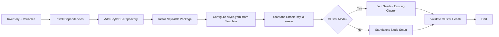

# ScyllaDB Ansible Role – Documentation


---
## Author Information

| Last Updated On | Version | Author           | Level            | Reviewer                      |
|-----------------|---------|------------------|------------------|-------------------------------|
| 01-09-2025      | V1.0    | Kawalpreet Kour  | Internal Review  | Pritam                        |
|                 |         | Kawalpreet Kour  | L0               | Shreya / Sharvari             |
|                 |         | Kawalpreet Kour  | L1               | Abhishek V                    |
|                 |         | Kawalpreet Kour  | L2               | Abhishek Dubey / Rishabh Sharma |

---

<details>
  <summary><h2><strong>Table of Contents</strong></h2></summary>

- [Introduction](#introduction)  
- [Pre-requisites](#pre-requisites) 
- [Workflow Diagram](#workflow-diagram)  
- [Ansible Role Directory Structure](#ansible-role-directory-structure)  
- [Role Components](#role-components)  
- [Variables and Templates](#variables-and-templates)  
- [Advantages](#advantages)  
- [Best Practices](#best-practices)  
- [FAQs](#faqs)  
- [Contact Information](#contact-information)  
- [References](#references)

</details>

---

## Introduction

This documentation defines the Ansible Role template for deploying and managing ScyllaDB, a high-performance distributed NoSQL database. The role follows a modular structure and can be extended in future sprints to include installation, configuration, and cluster management.


---

## Pre-requisites


| Item                  | Description                                                                 |
|-----------------------|-----------------------------------------------------------------------------|
| **OS Compatibility**  | CentOS 7/8, RHEL 7/8, Ubuntu 22.04+                                        |
| **Python**            | Python 3.x (required by Ansible)                                           |
| **Ansible Version**   | >= 2.9                                                                     |
| **Inventory File**    | Must define all target nodes with correct IPs or hostnames                 |
| **Private Key**       | Required for SSH authentication (password-less login recommended)          |
| **Ports**             | Required service ports must be open as per environment needs               |

---

> **Reference**: [ScyllaDB Documentation](https://github.com/Snaatak-Apt-Get-Swag/documentation/tree/main/OT-Microservices/Softwares/Scylladb/Introduction)

---

> **Reference**: [Ansible Role Documentation](https://github.com/Snaatak-Apt-Get-Swag/documentation/tree/main/Ansible/Role/Directory-Structure)

---

## Workflow Diagram


---

## Ansible Role Directory Structure
```bash
scylladb-ansible-role/
├── defaults/
│   └── main.yml            # Default variables (scylla_version, repo URL)
├── tasks/
│   ├── main.yml            # Master task file (imports sub-tasks)
│   ├── dependencies.yml    # Install dependencies (Java, curl, system tools)
│   ├── install.yml         # Install ScyllaDB package
│   └── configure.yml       # Configure scylla.yaml using Jinja2 template
├── templates/
│   └── scylla.yaml.j2      # Dynamic template for ScyllaDB configuration
├── handlers/
│   └── main.yml            # Handlers (restart scylla-server if config changes)
├── vars/
│   └── main.yml            # Env-specific variables (cluster, seeds, IPs)
├── meta/
    └── main.yml            # Role metadata (author, supported platforms)
```
---

## Role Components

| Component   | Description |
|-------------|-------------|
| **defaults/** | Provides default values for variables (safe defaults) |
| **tasks/**    | Contains modular task files for dependencies, installation, and configuration |
| **templates/** | Jinja2 templates for `scylla.yaml` |
| **handlers/** | Defines restart/reload actions (e.g., restart `scylla-server`) |
| **vars/**     | Environment-specific overrides (like cluster seeds, listen address) |
| **meta/**     | Metadata about the role (dependencies, supported platforms) |

---

## Variables and Templates

| Variable Name           | Description                          | Default Value                    |
|-------------------------|--------------------------------------|----------------------------------|
| **`scylla_version`**        | Version to install                   | `stable`                         |
| **`scylla_cluster_name`**   | Name of the ScyllaDB cluster         | `scylla-cluster`                 |
| **`scylla_seeds`**          | Seed nodes for clustering            | `["10.0.0.1", "10.0.0.2"]`       |
| **`scylla_listen_address`** | Node listen IP                       | `{{ ansible_host }}`             |
| **`scylla_rpc_address`**    | RPC IP address                       | `{{ ansible_host }}`             |


### Template: `scylla.yaml.j2`

This file will dynamically render the following values into the `scylla.yaml` config:

| Parameter           | Description                                |
|---------------------|--------------------------------------------|
| **`cluster_name`**      | Name of the ScyllaDB cluster               |
| **`seeds`**             | List of IPs for seed nodes                 |
| **`listen_address`**    | Address on which ScyllaDB listens          |
| **`rpc_address`**       | Address for client communication (RPC)     |
| **`endpoint_snitch`**   | Determines how ScyllaDB locates nodes      |

---
## Advantages

| Benefit                        | Description |
|--------------------------------|-------------|
| **Automated, repeatable deployments** | Ensures consistent setups across environments |
| **Reduces human errors**           | Eliminates manual steps prone to mistakes |
| **Supports cluster scaling**       | Easily add/remove nodes with Ansible inventory |
| **CI/CD friendly**                 | Integrates into pipelines for continuous delivery |
| **Reusable across environments**   | Works for dev, staging, and production |

---

## Best Practices

| Practice              | Description                                                   |
|-----------------------|---------------------------------------------------------------|
| **Use Vault for Secrets** | Store credentials or keys using Ansible Vault                 |
| **Tag Tasks**             | Use tags like `install`, `configure`, `cluster` for control   |
| **Run in Check Mode**     | Validate changes before applying                              |
| **Test in Dev First**     | Always test role in non-prod before rolling out               |
| **Enable Logging**        | Collect logs to troubleshoot deployment issues                |

---


## FAQs

**Q: Does this role install Scylla Monitoring/Manager?**  
A: No, initial scope is only ScyllaDB installation & configuration. Extensions possible.  

**Q: Can this role handle multi-node clusters?**  
A: Yes, by defining `scylla_seeds` in variables and inventory.  

---

## Contact Information

| Name            | Email |
|-----------------|---------------------------------------------|
| **Kawalpreet Kour** | kawalpreet.kour.snaatak@mygurukulam.co |

---

## References

| Description | Link |
|-------------|------|
| **ScyllaDB Documentation** | [GitHub – Introduction](https://github.com/Snaatak-Apt-Get-Swag/documentation/tree/main/OT-Microservices/Softwares/Scylladb/Introduction) |
| **POC on ScyllaDB** | [GitHub – POC](https://github.com/Snaatak-Apt-Get-Swag/documentation/tree/main/OT-Microservices/Softwares/Scylladb/POC) |
| **Ansible Role Directory Structure** | [GitHub – Role Structure](https://github.com/Snaatak-Apt-Get-Swag/documentation/tree/main/Ansible/Role/Directory-Structure) |
| **Ansible Static Inventory** | [GitHub – Static Inventory](https://github.com/Snaatak-Apt-Get-Swag/documentation/tree/main/Ansible/Inventory/Static-Inventory) |
| **Ansible Dynamic Inventory** | [GitHub – Dynamic Inventory](https://github.com/Snaatak-Apt-Get-Swag/documentation/tree/main/Ansible/Inventory/Dynamic-Inventory) |

