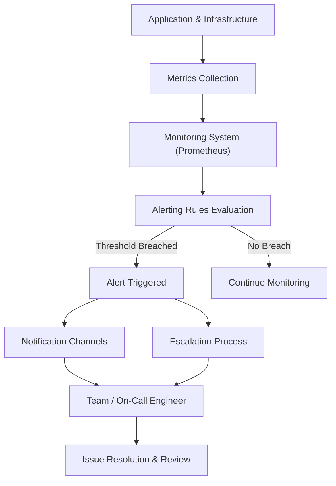

# Documentation On  

 

---
## Author Information

| Last Updated On | Version | Author           | Level            | Reviewer                      |
|-----------------|---------|------------------|------------------|-------------------------------|
| 02-10-2025      | V1.0    | Kawalpreet Kour  | Internal Review  | Sharvari                      |
|                 |         | Kawalpreet Kour  | L0               | Shreya                        |
|                 |         | Kawalpreet Kour  | L1               | Abhishek V                    |
|                 |         | Kawalpreet Kour  | L2               | Abhishek Dubey |

---

  
<h2><strong>Table of Contents</strong></h2>

1. [Introduction](#introduction)
2. [What Are Alerting Rules?](#what-are-alerting-rules)
3. [Why Use Alerting in App Monitoring?](#why-use-alerting-in-app-monitoring)
4. [Components of Alerting Rules](#components-of-alerting-rules)
5. [Alerting Workflow](#alerting-workflow)
6. [Common Alert Rules for Applications](#common-alert-rules-for-applications)
7. [Advantages of Alerting](#advantages-of-alerting)
8. [Limitations and Challenges](#limitations-and-challenges)
9. [Best Practices for Alerting](#best-practices-for-alerting)
10. [FAQs](#faqs)
11. [Contact Information](#contact-information)
12. [References](#references)

---
## Introduction

This document contains information about application monitoring, where **alerting rules** act like fire alarms. Just as a smoke detector warns you when it senses smoke, these rules notify you when something unusual happens in your application—such as high memory usage, errors, or slow response times.

---
### What Are Alerting Rules? 

Alerting rules are predefined conditions set in a monitoring system (like Prometheus). These rules trigger an alert when specific thresholds are breached, helping teams detect and respond to issues **before they cause major outages**.

---
### Why Use Alerting in App Monitoring?

| Reason                     | Description                                |
|----------------------------|--------------------------------------------|
| **Detect issues early**    | Identify problems before they affect users |
| **Respond quickly**        | Take fast action on service degradation or outages |
| **Minimize downtime**      | Reduce service interruptions and improve availability |
| **Automate alert delivery**| Send alerts automatically to the right people or systems |
| **Maintain system health** | Gain proactive insights to keep systems healthy |

---
## Components of Alerting Rules

| Component              | Description |
|------------------------|-------------|
| **Metrics**            | The data you monitor, e.g., CPU usage, memory consumption, error rates. |
| **Conditions / Thresholds** | Criteria for triggering an alert, e.g., CPU > 80% for 5 minutes. |
| **Evaluation Interval** | Frequency at which the monitoring system checks the conditions. |
| **Alert Name & Labels** | Unique identifiers and tags to categorize and filter alerts. |
| **Notification Channels** | Methods to deliver alerts, e.g., email, Slack, PagerDuty. |
| **Silencing / Inhibition** | Temporarily suppress alerts during maintenance or known downtimes. |

---
## Alerting Workflow

    
----
## Common Alert Rules for Applications

| Alert Rule                   | Condition / Threshold Example          | Purpose |
|-------------------------------|--------------------------------------|---------|
| High CPU Usage                | CPU > 80% for 5 min                   | Detect overloaded servers |
| High Memory Usage             | Memory > 90%                           | Prevent out-of-memory crashes |
| High Error Rate               | HTTP 5xx errors > 5% of requests      | Identify failing services |
| Increased Latency             | Response time > 2s (95th percentile)  | Monitor slow performance |
| Service Down                  | No heartbeat / health check fail for 1 min | Detect service unavailability |
| Disk Space Low                | Disk usage > 85%                       | Prevent disk filling issues |
| Database Connection Failures  | Connection errors exceed threshold    | Alert on DB access problems |
| High Request Rate             | Requests/sec > baseline + 50%         | Detect traffic spikes |
| Growing Queue Length          | Message queue length exceeds threshold | Indicates processing lag |

---

## Advantages of Alerting

| Advantage                  | Description |
|-----------------------------|------------|
| **Early Issue Detection**   | Identify problems before impacting users. |
| **Reduced Downtime**        | Minimize service interruptions through quick response. |
| **Proactive Monitoring**    | Respond before minor issues escalate. |
| **Improved Reliability**    | Catch failures early to maintain stability. |
| **Better Resource Usage**   | Focus team efforts only on real issues. |
| **Customizable Alerts**     | Tailor alerts to specific needs or environments. |
| **Enhanced Visibility**     | Gain real-time insights into system health. |

---

## Limitations and Challenges

| Limitation / Challenge          | Description |
|---------------------------------|------------|
| **Alert Fatigue**               | Too many alerts can overwhelm teams. |
| **False Positives**             | Alerts triggered when nothing is wrong. |
| **False Negatives**             | Real issues may not trigger alerts. |
| **Maintenance Overhead**        | Rules need regular updates as systems evolve. |
| **Noise from Non-critical Events** | Minor issues may generate unnecessary alerts. |
| **Configuration Complexity**    | Effective rules for complex systems can be hard to define. |
| **Lack of Context**             | Alerts without details slow down troubleshooting. |

---

## Best Practices for Alerting

| Best Practice                  | Description |
|--------------------------------|------------|
| **Define Clear Objectives**    | Focus on real business or system risks. |
| **Set Realistic Thresholds**   | Use data-driven thresholds to avoid noise. |
| **Focus on Key Metrics**       | Monitor only metrics critical to app health. |
| **Avoid Alert Fatigue**        | Alert only on actionable, high-impact issues. |
| **Include Context in Alerts**  | Provide severity, service, host info for faster response. |
| **Continuously Review & Improve** | Regularly update rules as systems and priorities evolve. |    

---

## FAQs

**Q: What is the difference between an alert and a metric?**  
**A:** A metric is raw data about system performance (like CPU usage or request rate), whereas an alert is a notification triggered when that metric crosses a predefined threshold.

**Q: How do I avoid alert fatigue in my team?**  
**A:** Focus on monitoring only key metrics, set realistic thresholds, and ensure alerts are actionable. Suppress non-critical alerts during maintenance or low-impact events.

**Q: Can alerts be integrated with multiple notification channels?**  
**A:** Yes. Alerts can be sent to email, Slack, Teams, PagerDuty, SMS, or custom webhooks simultaneously, ensuring the right people are notified promptly.

---

## Contact Information

| Name | Email |
|------|------|
| **Kawalpreet Kour** | kawalpreet.kour.snaatak@mygurukulam.co |

---

## References

| Description                 | Link |
|-----------------------------|------|
| Alerting Rules              | [Prometheus with Alertmanager](https://prometheus.io/docs/alerting/latest/alertmanager/) |
| Alerting Best Practices     | [Monitoring and Alerting Guide](https://www.datadoghq.com/monitoring-alerting-guide/) |
 

